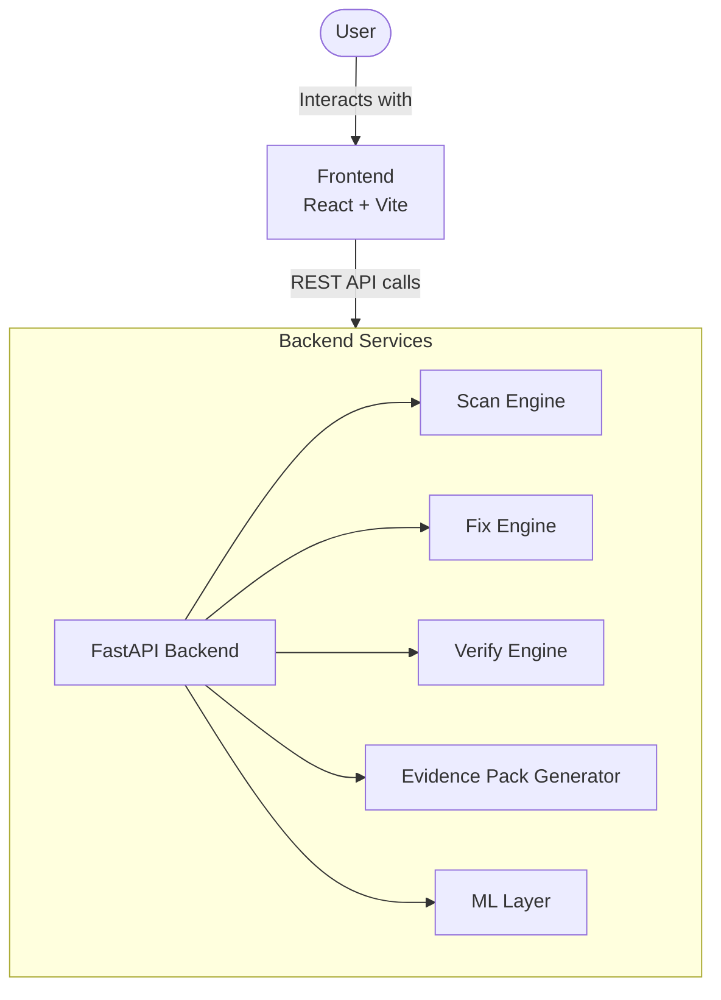
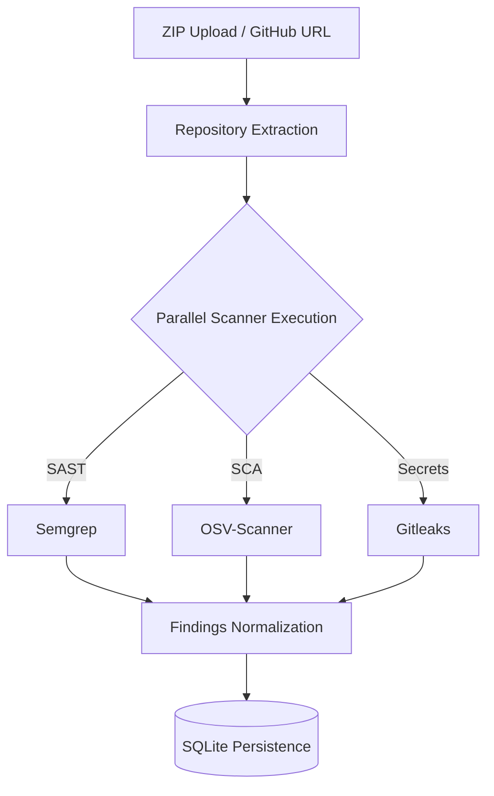
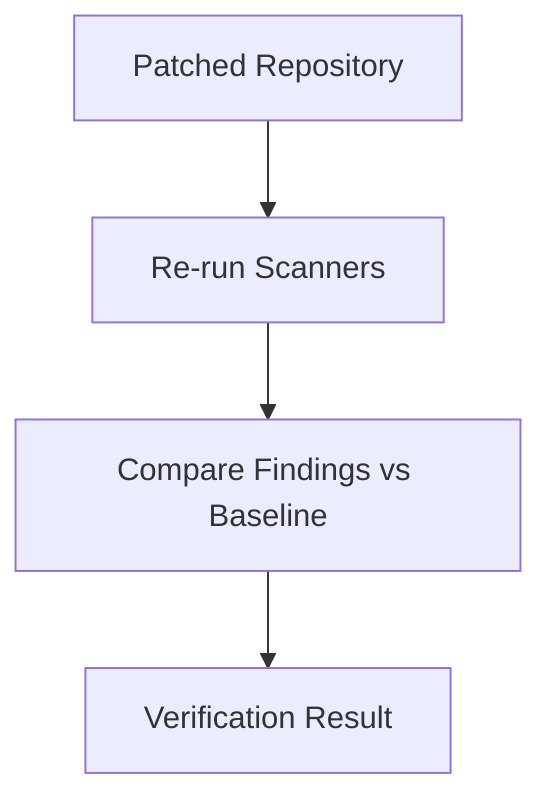
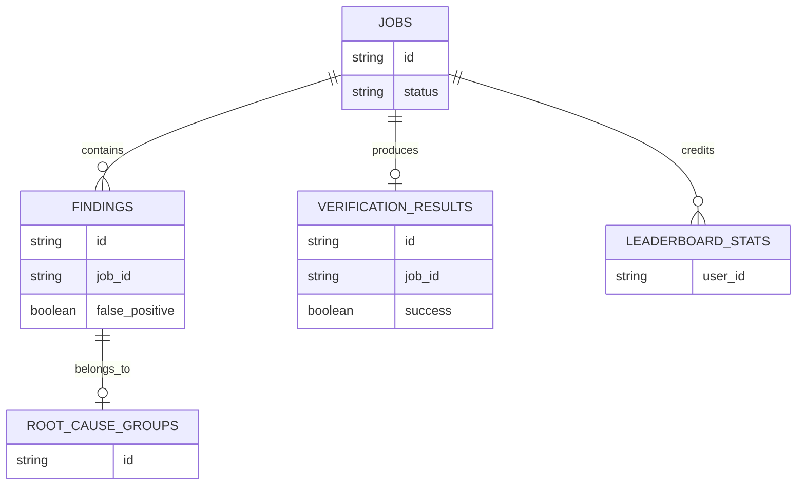
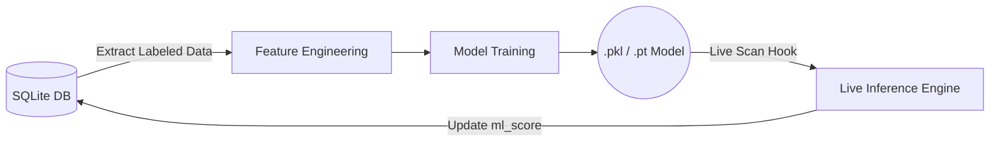

# PatchPilot Architecture

This document provides a high-level overview of PatchPilot's system design, data flow, major components, and the ML pipeline roadmap. It serves as a guide for contributors to understand how scanning, fixing, verification, and evidence generation interact.

---

## 1. System Overview

PatchPilot operates on a decoupled client-server architecture. The frontend handles user interaction and workspace state, while the FastAPI backend orchestrates heavy operations like repository extraction, parallel scanning, and ML inference.

---

## 2. Scan Pipeline

The scan pipeline is designed for speed and local execution. When a scan is initiated, the backend extracts the target codebase into an isolated temporary directory and executes multiple security engines in parallel.

---

## 3. Fix Pipeline

The Fix Pipeline transitions PatchPilot from a passive scanner to an active remediation tool.
* **Finding selection:** Users or automated rules select specific vulnerabilities from the database to target.
* **Fix generation:** The system proposes code modifications based on known safe patterns or (in the future) LLM-generated patches.
* **Patch application workflow:** Proposed fixes are applied to the temporary workspace clone of the repository.
* **Verification triggers:** Once patches are applied, the Fix Engine automatically queues the Verify Pipeline to ensure the fix is valid.

---

## 4. Verify Pipeline

Verification ensures that proposed fixes actually resolve the vulnerability without breaking the build or introducing new issues.

---

## 5. Evidence Pack Architecture

To support compliance and security auditing, the Evidence Pack Generator compiles a downloadable ZIP containing the following artifacts:
* `findings.json`: A complete machine-readable list of all vulnerabilities discovered.
* `verification-report.json`: Status of all attempted patches and their verification results.
* `remediation-summary.txt`: A human-readable overview of what was fixed and what remains open.
* `attack-paths.json` *(if enabled)*: Graph mapping of potential exploit chains.
* `SARIF exports` *(if enabled)*: Standardized Static Analysis Results Interchange Format files for CI/CD integration.

---

## 6. Database Architecture

PatchPilot uses a local SQLite database for speed, portability, and privacy. 

*(Note: `leaderboard_stats` is planned for future tracking of top contributors and patch submissions).*

---

## 7. ML Roadmap Architecture

PatchPilot is actively transitioning from static rules to intelligent analysis. The roadmap is split into three tiers:

* **Tier 1 — Triage:** Severity Ranking, Semantic Deduplication, and False Positive Classification.
* **Tier 2 — Predictive:** Fix Success Prediction, Pattern Clustering, and Exploit Likelihood Scoring.
* **Tier 3 — Autonomous:** Local LLM Patch Generation, Self-Healing Verification Loops, and Reinforcement Feedback Systems.

### Training Data Flow

---

## 8. Frontend Architecture

The React/Vite frontend is structured to provide a seamless audit experience. 

**Core Pages:**
* `/` (Dashboard): Job creation and overview.
* `/findings`: Interactive table for triaging, labeling false positives, and filtering vulnerabilities.
* `/verify`: Interface for applying and confirming fixes.
* `/leaderboard`: Gamified metrics for team deployments.
* *Future ML Views*: Dashboards for observing model confidence and automated patch suggestions.

**API Interaction Patterns:**
The frontend communicates with the FastAPI backend via REST. Long-running tasks (like repository scanning and extraction) utilize polling to update the UI without blocking the main thread.

---

## 9. Security Considerations

Because PatchPilot processes untrusted, potentially malicious codebases, the architecture enforces strict security boundaries:
* **Upload limits:** File size limits prevent DoS attacks via massive ZIP bombs.
* **Zip Slip prevention:** Strict path resolution during extraction prevents archives from writing outside the designated workspace.
* **Temporary workspace isolation:** Every scan job receives a unique, ephemeral directory that is wiped upon job deletion.
* **Input validation:** All URLs, file paths, and rule IDs are sanitized before being passed to shell processes.
* **Scanner sandboxing assumptions:** Scanners (Semgrep, OSV, Gitleaks) are executed as subprocesses without elevated privileges.