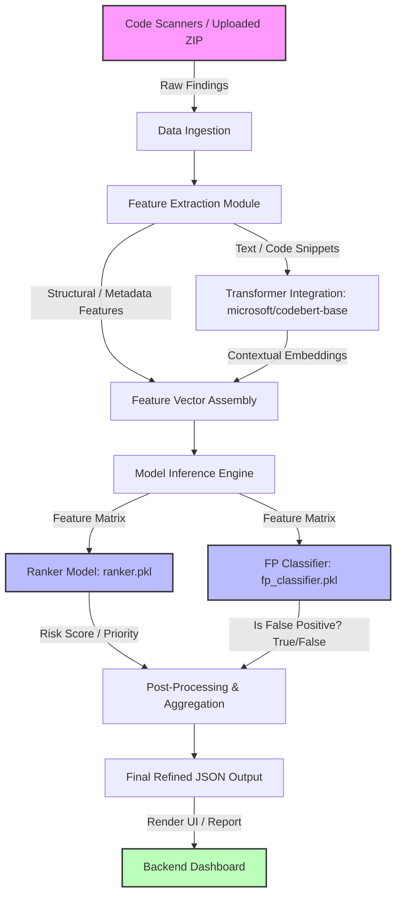

# Machine Learning Architecture

This document provides a comprehensive overview of the end-to-end Machine Learning pipeline and model lifecycle within the project.

## 1. Pipeline Visualization

## 2. Component Breakdown

### A. Data Ingestion & Scanners
* Accepts raw code files via ZIP uploads or repository scans.
* Extracts structural syntax trees and raw text snippets containing suspected security vulnerabilities.

### B. Feature Extraction & Embedding
* Computes static properties like line counts, nesting depth, and confidence scores.
* Leverages `microsoft/codebert-base` to convert code tokens into fixed-size contextual embeddings.

### C. Predictive ML Models (`ranker.py` & `fp_predictor.py`)
* **Ranker Model (`ranker.pkl`)**: Assigns dynamic risk scores. Defaults to scanner severity if absent.
* **False Positive Classifier (`fp_classifier.pkl`)**: Identifies benign patterns. Assumes legitimate if absent.
